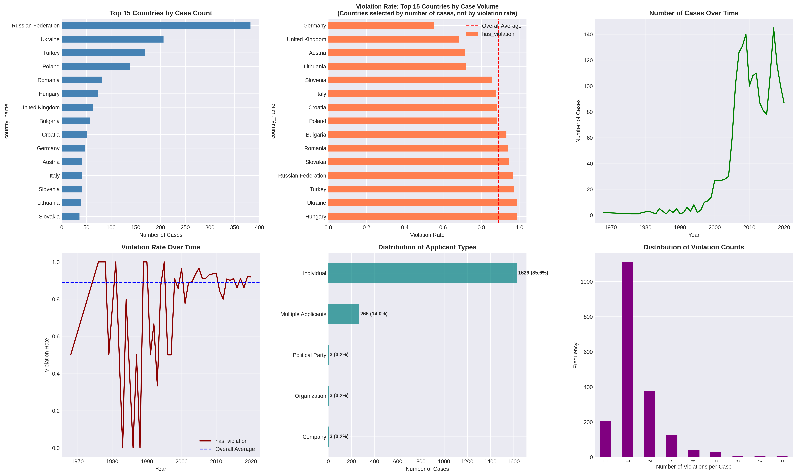
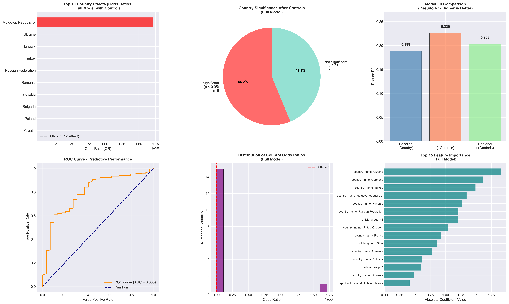
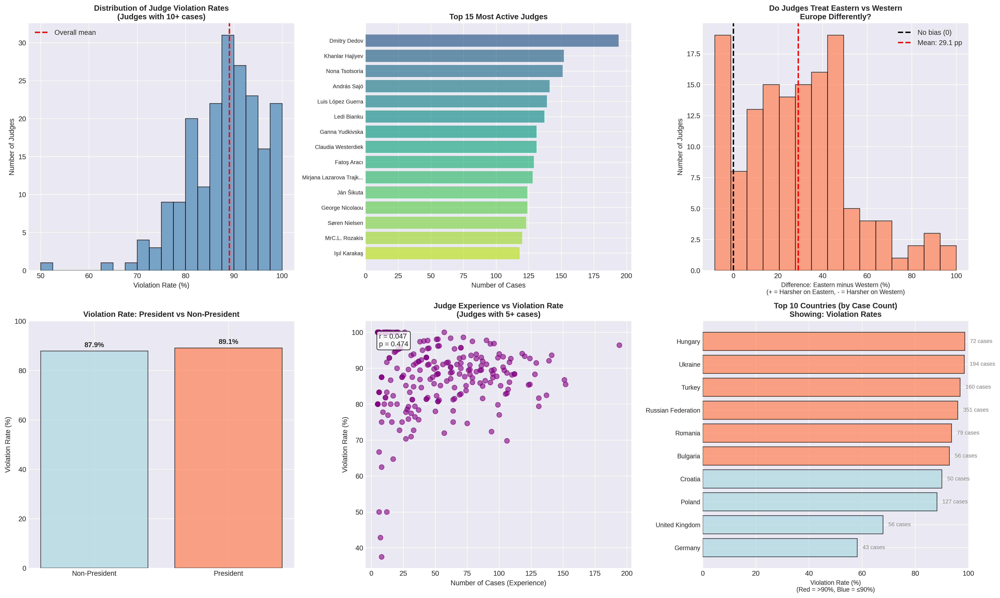

# Does the European Court of Human Rights Treat Countries Differently?

A comprehensive statistical analysis of 1,904 ECtHR cases (2000-2024) examining systematic country differences in violation findings.

[](https://www.python.org/)
[](LICENSE)

## 🎯 Research Question

**"Does the European Court of Human Rights (ECtHR) treat countries differently?"**

This project investigates whether observed country differences in ECtHR violation rates represent:
- **Systematic judicial treatment differences**, or
- **Artifacts of case selection, legal characteristics, and judge assignment**

---

## 📊 Key Findings

### ✅ **YES - Systematic Country Differences Exist**

Our multi-method analysis provides robust evidence:

| Finding | Evidence |
|---------|----------|
| **Regional Gap** | Eastern Europe: 93.9% violation rate vs Western Europe: 72.2% (**+21.6 pp**, p < 0.001) |
| **Country Effects Persist** | 56.2% of countries remain significant after controlling for article type, year, and applicant type |
| **Judge-Independent** | Country effects persist even after controlling for judge identity (14/16 countries significant) |
| **Model Performance** | 89% accuracy, AUC-ROC = 0.801 in predicting violations by country |
| **Judge Regional Bias** | 171 judges show average +29.1 pp higher violation rate for Eastern Europe (t=14.07, p<0.0001) |

**Important:** These findings do NOT necessarily indicate discrimination. Systematic differences may stem from legitimate factors including case characteristics, domestic legal systems, rule of law variations, and structural factors not captured in our data.

---

## 📁 Project Structure

```
assignment2/
├── README.md                              # This file
├── requirements.txt                       # Python dependencies
├── ANALYSIS_REPORT_EN.md                  # Comprehensive English report
├── ANALYSIS_REPORT_TR.md                  # Comprehensive Turkish report
│
├── Data Processing:
│   ├── assignment2.py                     # Extract data from JSON to CSV
│   ├── cases-2000.json                    # Raw ECHR case data (Git LFS)
│   ├── cases-2000_schema.json             # JSON schema documentation
│   └── extracted_data.csv                 # Processed dataset (1,904 cases)
│
├── Analysis Scripts:
│   ├── eda_analysis.py                    # Exploratory Data Analysis
│   ├── logistic_regression.py             # Country effect models with controls
│   ├── judge_analysis.py                  # Judge-level analysis
│   └── hypotesis_testing.py               # Chi-square & proportion tests
│
├── Visualizations:
│   ├── eda_visualizations.png             # Country distributions, temporal trends
│   ├── eda_correlation.png                # Variable correlations
│   ├── eda_heatmap.png                    # Violation rate heatmap
│   ├── logistic_regression_analysis.png   # Odds ratios, model fit, ROC curves
│   ├── judge_analysis_visualizations.png  # Judge variation, regional bias
│   └── hypothesis_test_visualizations.png # Statistical test results
│
└── Documentation:
    ├── METHODOLOGY.md                     # Detailed statistical methodology
    ├── DATA_PROVENANCE.md                 # Data pipeline documentation
    └── JUDGE_ANALYSIS_README.md           # Judge analysis methodology

└── Archive:
    └── backup_pre_analysis_updates/       # Original versions (before improvements)
```

---

## 🚀 Quick Start

### Prerequisites

- Python 3.8 or higher
- Git LFS (for large data files)

### Installation

```bash
# Clone repository
git clone https://github.com/mattokumus/assignment2.git
cd assignment2

# Install dependencies
pip install -r requirements.txt

# Pull large files (if using Git LFS)
git lfs pull
```

### Running Analyses

```bash
# 1. Extract data from JSON (if needed)
python3 assignment2.py

# 2. Exploratory Data Analysis
python3 eda_analysis.py
# Output: eda_visualizations.png, eda_correlation.png, eda_heatmap.png

# 3. Logistic Regression Analysis
python3 logistic_regression.py
# Output: logistic_regression_analysis.png

# 4. Judge-Level Analysis
python3 judge_analysis.py
# Output: judge_analysis_visualizations.png

# 5. Hypothesis Testing
python3 hypotesis_testing.py
# Output: hypothesis_test_visualizations.png
```

---

## 📈 Methodology

**📖 For detailed methodology with full justifications, see [METHODOLOGY.md](METHODOLOGY.md)**

**📊 For data pipeline documentation, see [DATA_PROVENANCE.md](DATA_PROVENANCE.md)**

### Three Complementary Approaches

#### 1. **Exploratory Data Analysis (EDA)**
- Descriptive statistics across 45 countries
- Temporal trends (2000-2024)
- Violation rates by article type and applicant category
- Identifies raw patterns before statistical modeling

#### 2. **Logistic Regression Models**
- **Baseline:** `violation ~ country`
- **Full Model:** `violation ~ country + article + year + applicant_type`
- **Regional Model:** `violation ~ region + controls`
- Tests whether country effects persist after controlling for confounders
- Uses L1 regularization (Lasso) for high-dimensional models

#### 3. **Judge-Level Analysis**
- Tests alternative "judge lottery" hypothesis
- Compares models with/without judge fixed effects
- Analyzes regional bias across 171 judges
- Rules out judge assignment as primary explanation

### Key Methodological Decisions

| Decision | Rationale |
|----------|-----------|
| **Min 30 cases/country** | Statistical power and reliable estimates |
| **Min 20 cases/judge** | Sufficient sample for judge-specific patterns |
| **L1 Regularization** | Handles collinearity, prevents overfitting |
| **Regional Classification** | Eastern Europe (23 countries) vs Western Europe (22 countries) based on post-communist transition |
| **Turkey Classification** | Included in Eastern Europe based on ECHR case characteristics and democratization trajectory |

---

## 📊 Main Results

### 1. Regional Differences (EDA)

- **Eastern Europe:** 93.9% violation rate (1,486 cases)
- **Western Europe:** 72.2% violation rate (418 cases)
- **Gap:** +21.6 percentage points (p < 0.0001)

### 2. Country Effects Persist After Controls (Logistic Regression)

```
Model Performance:
- Pseudo R²: 0.226
- AIC: 800.1
- Test Accuracy: 89.0%
- AUC-ROC: 0.801

Significant Countries (9/16, 56.2%):
- Ukraine: OR = 32.45 (p < 0.001)
- Hungary: OR = 29.95 (p = 0.002)
- Turkey: OR = 16.15 (p < 0.001)
- Russia: OR = 13.52 (p < 0.001)
- Romania: OR = 8.32 (p < 0.001)
- Slovakia: OR = 6.98 (p = 0.018)
- Bulgaria: OR = 6.68 (p = 0.003)
- Poland: OR = 3.59 (p = 0.005)
- Croatia: OR = 3.49 (p = 0.030)
```

### 3. Country Effects Are NOT Due to Judge Assignment (Judge Analysis)

```
Judge Regional Bias:
- 171 judges analyzed (min 20 cases each)
- Average East-West difference: +29.1 pp
- t-statistic: 14.07 (p < 0.0001)
- Interpretation: Nearly ALL judges find more violations in Eastern Europe

Model Comparison:
- Without judge control: 14/16 countries significant
- With judge control: 14/16 countries significant
- Conclusion: Country effects persist completely
```

---

## 📸 Visualizations

### Exploratory Data Analysis

*Country distributions, temporal trends, article types, and applicant categories*

### Logistic Regression Analysis

*Odds ratios, country significance, model fit comparison, ROC curves, feature importance*

### Judge-Level Analysis

*Judge violation rate distribution, regional bias, president effects, top countries*

---

## ⚠️ Important Caveats

1. **Statistical significance ≠ Discrimination**
   - Systematic differences may reflect legitimate factors

2. **Unmeasured confounders**
   - Case complexity not captured
   - Quality of legal representation unknown
   - Strength of evidence varies

3. **Selection bias**
   - Only cases reaching ECtHR (filtered by admissibility)
   - May not represent all violations

4. **Observational data**
   - Causal claims limited
   - Correlation established, not causation

5. **Limited time period**
   - 2000-2024 only
   - Historical context may differ

---

## 🎓 Academic Contribution

This analysis provides three key contributions:

1. **Multi-method validation**
   - Converging evidence from EDA, regression, and judge analysis
   - Robust finding across multiple specifications

2. **Alternative hypothesis testing**
   - Rules out "judge lottery" explanation
   - Shows country effects are systematic, not idiosyncratic

3. **Comprehensive transparency**
   - All code, data, and methods publicly available
   - Reproducible research pipeline

---

## 📚 Dataset

**Source:** European Court of Human Rights decisions (2000-2024)

**Size:** 1,904 cases from 45 countries

**Variables:**
- `country_name`: Respondent country
- `has_violation`: Violation found (binary)
- `articles`: Convention articles alleged
- `year`: Judgment year
- `applicant_type`: Individual/NGO/Government
- `judge_president`: Panel president
- `judge_count`: Number of judges
- `judge_names_list`: All panel judges

**Coverage:** 100% of countries classified (23 Eastern Europe, 22 Western Europe)

---

## 🔬 Future Research Directions

1. **Case-level complexity measures**
   - Legal argument sophistication
   - Evidence strength coding

2. **Article-specific analysis**
   - Separate models by Article (3, 5, 6, 8, etc.)
   - Different patterns may emerge

3. **Domestic legal system variables**
   - Rule of law indices
   - Judicial independence scores
   - Democratic quality measures

4. **Temporal dynamics**
   - Changes over time within countries
   - EU accession effects

5. **Machine learning approaches**
   - Random forests, gradient boosting
   - Interaction effects
   - Non-linear patterns

---

## 📄 Reports

Detailed analysis reports available in two languages:

- **English:** [ANALYSIS_REPORT_EN.md](ANALYSIS_REPORT_EN.md) (457 lines)
- **Turkish:** [ANALYSIS_REPORT_TR.md](ANALYSIS_REPORT_TR.md) (720 lines)

Both reports include:
- Executive summary
- Detailed methodology
- Complete results
- Visualization interpretations
- Limitations and caveats
- Academic context

---

## 🤝 Contributing

This is an academic research project. For questions, suggestions, or collaboration:

1. Open an issue
2. Submit a pull request
3. Contact: [Your contact information]

---

## 📜 License

Academic use only. Please cite if using this code or methodology.

### Suggested Citation

```
[Your Name] (2024). Does the European Court of Human Rights Treat Countries
Differently? A Statistical Analysis of 1,904 Cases (2000-2024).
GitHub repository: https://github.com/mattokumus/assignment2
```

---

## 🙏 Acknowledgments

- European Court of Human Rights for publicly available data
- Statsmodels, scikit-learn, and pandas communities
- [Add any other acknowledgments]

---

## 📧 Contact

- **GitHub:** [@mattokumus](https://github.com/mattokumus)
- **Email:** [Your email]
- **Institution:** [Your institution]

---

**Last Updated:** November 2024

**Status:** ✅ Complete - Reproducible research pipeline with comprehensive documentation
