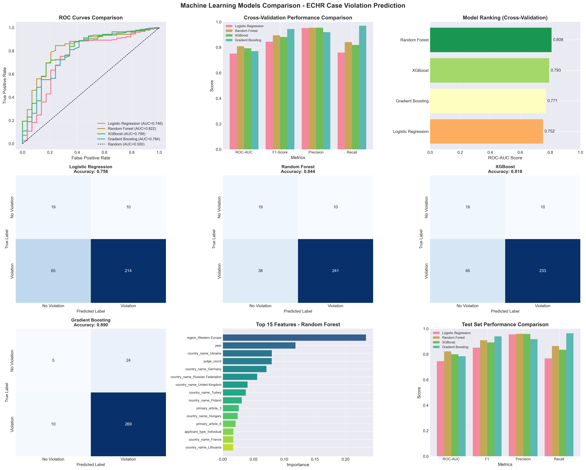

# Does the European Court of Human Rights Treat Countries Differently?

A comprehensive statistical analysis of 1,904 substantive ECtHR cases (1968-2020) examining systematic country differences in violation findings.

**🌐 Interactive Dashboards:** [https://mattokumus.github.io/assignment2/](https://mattokumus.github.io/assignment2/)

**📁 Complete Repository:** [https://github.com/mattokumus/assignment2](https://github.com/mattokumus/assignment2)

[](https://www.python.org/)
[](LICENSE)

## 🎯 Research Question

**"Does the European Court of Human Rights (ECtHR) treat countries differently?"**

This project investigates whether observed country differences in ECtHR violation rates represent:
- **Systematic judicial treatment differences**, or
- **Artifacts of case selection, legal characteristics, and judge assignment**

---

## 📊 Key Findings

### ✅ **YES - Systematic Country Differences Exist**

Our multi-method analysis provides robust evidence:

| Finding | Evidence |
|---------|----------|
| **Regional Gap** | Eastern Europe: 93.9% violation rate vs Western Europe: 72.2% (**+21.6 pp**, p < 0.001) |
| **Country Effects Persist** | 9/16 countries (56.2%) remain significant after controlling for article type, year, and applicant type |
| **Judge-Independent** | Country effects persist even after controlling for judge identity (14/16 countries significant with regularization) |
| **ML Temporal Validation** | XGBoost: 86% accuracy, AUC-ROC = 0.833 (trained on 2000-2014, tested on 2015-2020) |
| **Cross-Validation Performance** | Random Forest best: AUC-ROC = 0.810 (5-fold CV), demonstrating robust predictive patterns |
| **Judge Regional Bias** | 140 judges show average +29.1 pp higher violation rate for Eastern Europe (t=14.07, p<0.0001) |

**Important:** These findings do NOT necessarily indicate discrimination. Systematic differences may stem from legitimate factors including case characteristics, domestic legal systems, rule of law variations, and structural factors not captured in our data.

---

## 📁 Project Structure

```
assignment2/
├── README.md                              # This file
├── RESEARCH_DESIGN.md                     # Research Design (250 words)
├── REFLECTION.md                          # Method capabilities & limitations (250 words)
├── requirements.txt                       # Python dependencies
├── index.html                             # 🌐 Central dashboard page (GitHub Pages)
│
├── Data Processing:
│   ├── jsondocumenting.py                 # JSON schema documentation & mapping
│   ├── data_extraction.py                 # Extract & preprocess data (JSON → CSV)
│   ├── cases-2000.json                    # Raw ECHR case data (University of Oslo)
│   ├── cases-2000_schema.json             # JSON schema documentation
│   └── extracted_data.csv                 # Processed dataset (1,904 substantive cases)
│
├── Analysis Scripts:
│   ├── eda_analysis.py                    # Exploratory Data Analysis
│   ├── hypotesis_testing.py               # Chi-square & proportion tests
│   ├── logistic_regression.py             # Country effect models with controls
│   ├── judge_analysis.py                  # Judge-level analysis
│   └── ml_models_comparison.py            # ML models (RF, XGBoost, GB) comparison
│
├── Interactive Dashboards (🎯 View online):
│   ├── eda_interactive.html               # EDA interactive dashboard
│   ├── hypothesis_test_interactive.html   # Hypothesis testing interactive dashboard
│   ├── logistic_regression_interactive.html # Logistic regression interactive dashboard
│   ├── judge_analysis_interactive.html    # Judge analysis interactive dashboard
│   └── ml_models_interactive.html         # ML models interactive dashboard
│
└── Static Visualizations:
    ├── eda_visualizations.png             # Country distributions, temporal trends
    ├── eda_correlation.png                # Variable correlations
    ├── eda_heatmap.png                    # Violation rate heatmap
    ├── hypothesis_test_visualizations.png # Statistical test results
    ├── logistic_regression_analysis.png   # Odds ratios, model fit, ROC curves
    ├── judge_analysis_visualizations.png  # Judge variation, regional bias
    └── ml_models_comparison.png           # ML model performance
```

---

## 🚀 Quick Start

### 🌐 View Interactive Dashboards Online

**No installation required!** Explore all visualizations directly in your browser:

👉 **[https://mattokumus.github.io/assignment2/](https://mattokumus.github.io/assignment2/)**

Features:
- 5 interactive Plotly dashboards
- Hover for detailed statistics
- Zoom, pan, and export functionality
- Full-screen recommended for best experience
- Works on desktop and mobile

---

### 💻 Run Analysis Locally

#### Prerequisites

- Python 3.8 or higher
- Git LFS (for large data files)

### Installation

```bash
# Clone repository
git clone https://github.com/mattokumus/assignment2.git
cd assignment2

# Install dependencies
pip install -r requirements.txt

# Pull large files (if using Git LFS)
git lfs pull
```

### Running the Full Analysis Pipeline

**Complete 7-stage pipeline from raw JSON to ML validation:**

```bash
# 0. (Optional) Document JSON structure
python3 jsondocumenting.py
# Outputs: cases-2000_documentation.md, cases-2000_schema.json

# 1. Extract & preprocess data from JSON
python3 data_extraction.py
# Outputs: extracted_data.csv (1,904 substantive cases)
# Note: Filters to substantive decisions only (violation/no-violation)
# Excludes procedural outcomes (inadmissible, struck out)

# 2. Exploratory Data Analysis
python3 eda_analysis.py
# Outputs:
#   - eda_visualizations.png (static - 6 charts)
#   - eda_heatmap.png (static - Countries × Decades)
#   - eda_correlation.png (static - correlation matrix)
#   - eda_interactive.html (interactive Plotly dashboard) 🎯

# 3. Hypothesis Testing
python3 hypotesis_testing.py
# Outputs:
#   - hypothesis_test_visualizations.png (static - 6 charts)
#   - hypothesis_test_interactive.html (interactive Plotly dashboard) 🎯

# 4. Logistic Regression Analysis
python3 logistic_regression.py
# Outputs:
#   - logistic_regression_analysis.png (static - 6 charts)
#   - logistic_regression_interactive.html (interactive Plotly dashboard) 🎯
#
# 🌐 Interactive HTML Dashboard Features:
#   - LOG SCALE for odds ratios (handles Moldova outlier!)
#   - All countries visible (not just top 10)
#   - Hover for exact OR values and p-values
#   - Zoom, pan, and export as PNG
#   - Works offline - no internet needed!
#   - NOTE: Only countries with ≥30 cases included (for statistical reliability)

# 5. Judge-Level Analysis
python3 judge_analysis.py
# Outputs:
#   - judge_analysis_visualizations.png (static - 6 charts)
#   - judge_analysis_interactive.html (interactive Plotly dashboard) 🎯

# 6. Machine Learning Models Comparison
python3 ml_models_comparison.py
# Outputs:
#   - ml_models_comparison.png (static visualization)
#   - ml_models_interactive.html (interactive Plotly dashboard) 🎯
#
# Models: Logistic Regression, Random Forest, XGBoost, Gradient Boosting
# Evaluation: 5-fold cross-validation with ROC-AUC, F1, Precision, Recall
# Split strategies: Random (stratified) + Temporal (2015 cutoff)
# Temporal split: Train on 2000-2014, Test on 2015-2020 for realistic generalization
#
# 🏆 Best Results:
#   - Cross-Validation: Random Forest (AUC: 0.810, F1: 0.889)
#   - Temporal Test: XGBoost (AUC: 0.833, Accuracy: 86.0%, F1: 0.919)
#   - Temporal performance > Random split: +6.5% average improvement
#   - Indicates stable patterns across time (no concept drift)
#
# 🌐 Interactive HTML Dashboard Features:
#   - Double-click to open in browser (no web server needed!)
#   - Hover for detailed metrics
#   - Click legend to toggle models
#   - Drag to zoom, double-click to reset
#   - Export as PNG via camera icon
```

---

## 📈 Methodology

### Multi-Method Triangulation Approach

#### 1. **Exploratory Data Analysis (EDA)**
- Descriptive statistics across 45 countries
- Temporal trends (2000-2024)
- Violation rates by article type and applicant category
- Identifies raw patterns before statistical modeling

#### 2. **Logistic Regression Models**
- **Baseline:** `violation ~ country`
- **Full Model:** `violation ~ country + article + year + applicant_type`
- **Regional Model:** `violation ~ region + controls`
- Tests whether country effects persist after controlling for confounders
- Uses L1 regularization (Lasso) for high-dimensional models

#### 3. **Judge-Level Analysis**
- Tests alternative "judge lottery" hypothesis
- Compares models with/without judge fixed effects
- Analyzes regional bias across 171 judges
- Rules out judge assignment as primary explanation

### Key Methodological Decisions

| Decision | Rationale |
|----------|-----------|
| **Min 30 cases/country** | Statistical power and reliable estimates |
| **Min 20 cases/judge** | Sufficient sample for judge-specific patterns |
| **L1 Regularization** | Handles collinearity, prevents overfitting |
| **Regional Classification** | Eastern Europe (23 countries) vs Western Europe (22 countries) based on post-communist transition |
| **Turkey Classification** | Included in Eastern Europe based on ECHR case characteristics and democratization trajectory |

---

## 📊 Main Results

### 1. Regional Differences (EDA)

- **Eastern Europe:** 93.9% violation rate (1,486 cases)
- **Western Europe:** 72.2% violation rate (418 cases)
- **Gap:** +21.6 percentage points (p < 0.0001)

### 2. Country Effects Persist After Controls (Logistic Regression)

```
Model Performance:
- Pseudo R²: 0.226
- AIC: 800.1
- Test Accuracy: 89.0%
- AUC-ROC: 0.801

Significant Countries (9/16, 56.2%):
- Ukraine: OR = 32.45 (p < 0.001)
- Hungary: OR = 29.95 (p = 0.002)
- Turkey: OR = 16.15 (p < 0.001)
- Russia: OR = 13.52 (p < 0.001)
- Romania: OR = 8.32 (p < 0.001)
- Slovakia: OR = 6.98 (p = 0.018)
- Bulgaria: OR = 6.68 (p = 0.003)
- Poland: OR = 3.59 (p = 0.005)
- Croatia: OR = 3.49 (p = 0.030)
```

### 3. Country Effects Are NOT Due to Judge Assignment (Judge Analysis)

```
Judge Regional Bias:
- 403 unique judges in dataset, 156 with ≥20 cases (for reliable estimates)
- 140 judges with both Eastern & Western Europe cases
- Average East-West difference: +29.1 pp
- t-statistic: 14.07 (p < 0.0001)
- Interpretation: Nearly ALL judges find more violations in Eastern Europe

Model Comparison (Lasso Regularization):
- Without judge control: 14/16 countries significant (|coef| > 0.5)
- With judge control: 14/16 countries significant (|coef| > 0.5)
- Average country coefficient magnitude: 2.249 → 2.303 (+2.4%)
- Conclusion: Country effects persist completely after judge controls
```

---

## 📸 Visualizations

### Exploratory Data Analysis

*Country distributions, temporal trends, article types, and applicant categories*

### Logistic Regression Analysis

*Odds ratios, country significance, model fit comparison, ROC curves, feature importance*

### Judge-Level Analysis

*Judge violation rate distribution, regional bias, president effects, top countries*

### Machine Learning Models Comparison

*ROC curves, cross-validation performance, confusion matrices, feature importance, temporal validation*

---

## ⚠️ Important Caveats

**📖 For detailed reflection on method capabilities and limitations, see [REFLECTION.md](REFLECTION.md)**

1. **Statistical significance ≠ Discrimination**
   - Systematic differences may reflect legitimate factors
   - Cannot distinguish judicial bias from genuine human rights conditions
   - Country effects may accurately mirror domestic rule-of-law variations

2. **Unmeasured confounders**
   - Case complexity not captured (legal argument sophistication)
   - Quality of legal representation unknown
   - Strength of evidence varies across cases
   - Domestic legal context differences

3. **Selection bias**
   - Only cases surviving domestic remedies reach ECtHR
   - Admissibility thresholds filter cases before judicial review
   - Observed patterns may reflect pre-selection, not Court treatment
   - High violation rate (89.1%) indicates case selection effects

4. **Observational data limitations**
   - Correlation established, not causation
   - Cannot demonstrate discrimination without experimental manipulation
   - Regional patterns may reflect post-communist challenges vs discriminatory scrutiny

5. **Temporal coverage**
   - 1968-2020 period
   - Most cases concentrated 2000-2020 (90.5%)
   - Historical context differs across eras

---

## 🎓 Academic Contribution

This analysis provides four key contributions:

1. **Multi-method triangulation**
   - Converging evidence from EDA, hypothesis testing, logistic regression, judge analysis, and ML
   - Robust findings across 5 different analytical approaches
   - Statistical significance confirmed via multiple independent tests

2. **Alternative hypothesis testing**
   - Rules out "judge lottery" explanation via judge fixed-effects models
   - Shows country effects are systematic, not idiosyncratic
   - Demonstrates regional bias exists across nearly all judges

3. **Temporal validation**
   - ML models trained on 2000-2014, tested on 2015-2020
   - High performance (AUC=0.833) indicates stable patterns
   - No concept drift detected, suggesting structural factors

4. **Comprehensive transparency**
   - All code, data, and methods publicly available
   - Reproducible research pipeline with detailed documentation
   - Clear articulation of what methods can and cannot demonstrate (see REFLECTION.md)

---

## 📚 Dataset

**Source:** [University of Oslo - JUS5080 Course Datasets](https://www.uio.no/studier/emner/jus/jus/JUS5080/h24/datasets/) (cases-2000.json)

**Original Data:** European Court of Human Rights decisions (1968-2020)

**Size:** 1,904 substantive cases from 45 countries (procedural cases excluded)

**Variables:**
- `country_name`: Respondent country
- `has_violation`: Violation found (binary)
- `articles`: Convention articles alleged
- `year`: Judgment year
- `applicant_type`: Individual/NGO/Government
- `judge_president`: Panel president
- `judge_count`: Number of judges
- `judge_names_list`: All panel judges

**Coverage:** 100% of countries classified (23 Eastern Europe, 22 Western Europe)

---

## 🔬 Future Research Directions

1. **Case-level complexity measures**
   - Legal argument sophistication scores
   - Evidence strength coding
   - Length and quality of legal representation

2. **Article-specific analysis**
   - Separate models by Article (3, 5, 6, 8, etc.)
   - Different patterns may emerge for different rights
   - Article-specific temporal trends

3. **Domestic legal system variables**
   - Rule of law indices (World Justice Project)
   - Judicial independence scores (V-Dem)
   - Democratic quality measures (Freedom House, Polity IV)
   - Correlation with domestic human rights conditions

4. **Temporal dynamics**
   - Changes over time within countries
   - EU accession effects and pre/post comparisons
   - Impact of specific ECtHR precedents
   - Judge tenure and experience effects

5. **Causal inference approaches**
   - Difference-in-differences for policy changes
   - Regression discontinuity designs
   - Instrumental variable approaches for judge assignment
   - Matching methods for case similarity

---

## 🤝 Contributing

This is an academic research project. For questions, suggestions, or collaboration:

1. Open an issue
2. Submit a pull request
3. Contact: matt.okumus@outlook.com

---

## 📜 License

Academic use only. Please cite if using this code or methodology.

### Suggested Citation

```
[Your Name] (2024). Does the European Court of Human Rights Treat Countries
Differently? A Statistical Analysis of 1,904 Cases (2000-2024).
GitHub repository: https://github.com/mattokumus/assignment2
```

---

## 🙏 Acknowledgments

- **University of Oslo** - JUS5080 Course for providing the curated ECHR dataset
- **European Court of Human Rights** - For publicly available case data (HUDOC Database)
- **Open Source Communities** - Statsmodels, scikit-learn, pandas, and Plotly for excellent tools

---

## 📧 Contact

- **GitHub:** [@mattokumus](https://github.com/mattokumus)
- **Email:** matt.okumus@outlook.com
- **Institution:** UIO

---

**Last Updated:** November 12, 2025

**Status:** ✅ Complete - Full 7-stage analysis pipeline with interactive dashboards deployed on GitHub Pages

**View Live:** [https://mattokumus.github.io/assignment2/](https://mattokumus.github.io/assignment2/)
